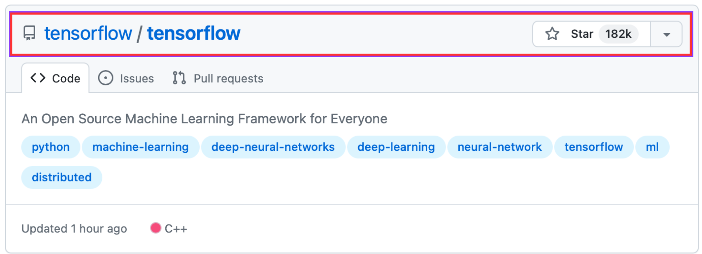
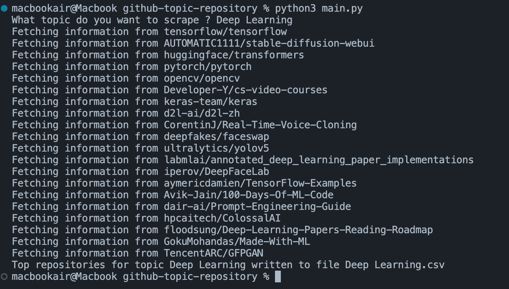
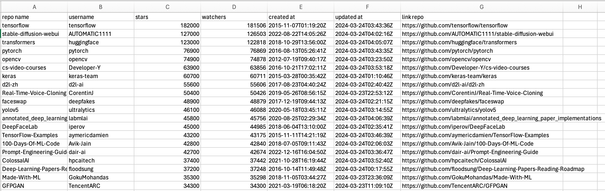
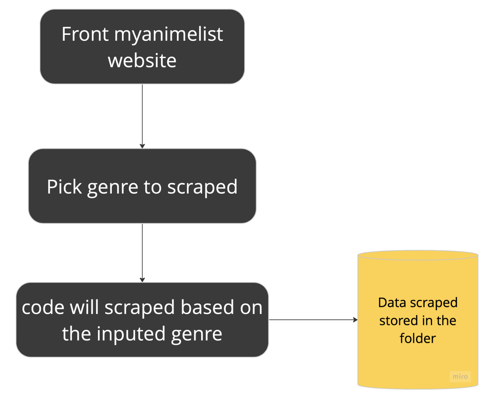
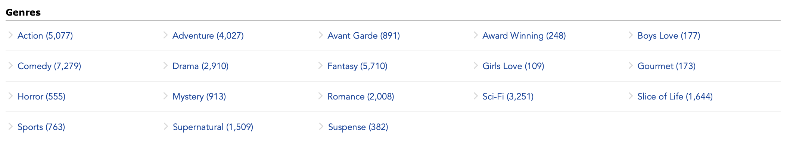
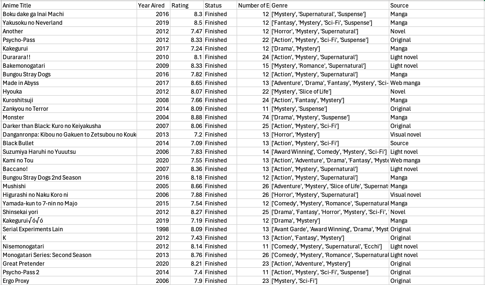

# Web Scraping Projects

This projects is aim to show web scraping using `python` and `BeautifulSoup` library.

In this projects, I did scrape on several website to gain some information I needed. You can find those scraped data and code from the link below.

1. [Github Topic Repository](https://github.com/rasyidsulaeman/Web-Scraping-Projects/tree/main/github-topic-repository)
2. [GPU Scrape on newegg.ca](https://github.com/rasyidsulaeman/Web-Scraping-Projects/tree/main/gpu-finding)
3. [Hockey Teams](https://github.com/rasyidsulaeman/Web-Scraping-Projects/tree/main/hockey-scrape)
4. [MyAnimeList](https://github.com/rasyidsulaeman/Web-Scraping-Projects/tree/main/myanimelist)

## More Detail of Two Projects

### Github Topic Repository
The idea of this project is I want to capture several information about the trending topic in github repository. 

The topic of interest should be input manually. Here as an example, I want to get [Deep Learning](https://github.com/topics/deep-learning) topic.



From the github repo, I want to obtain *the username*, *repository_name*, *number_of_stars*, *number_of_watchers*, *date_creation*, and *the links*. 

To obtain those data, run the `main.py` code in the [Github Topic Repository](https://github.com/rasyidsulaeman/Web-Scraping-Projects/tree/main/github-topic-repository) scrape folder

Run the code in the terminal VScode as below 
```
python3 main.py
```



The data will be saved in the folder and here's is a snapshot of the github-repo-topic



### MyAnimeList

This project is aim to obtain several information about anime based on genre on [myanimelist website](https://myanimelist.net/). Since I'm quite love to anime, so I did this scraping data. 

The information that I want to scraped are *anime title*, *year aired*, *rating*, *status*, *number of epsiode*, *genre*, source. 

The scraping workflow is quite simple, presented below



List of genre that can be scraped is showed below



After running the code, and input the interest genre, the data will be stored in csv file as follow

Here is an example when I scraped the *mystery genre* and I obtained 913 row data



## Notes

- The explanation on how each code works will be written later on medium
- Hope you get insight from this repo